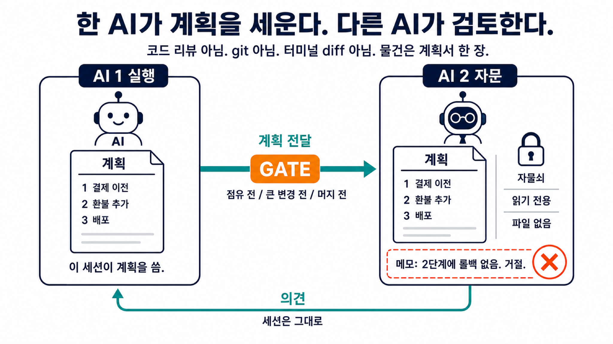

# orchestrator-consultant-gate-ko

오케스트레이션에 착수하기 전에, 실행 문서(계획과 자식 프롬프트)를 읽기 전용으로 비판하는 스킬입니다. 지금 세션의 에이전트는 바꾸지 않습니다. 검수는 토큰을 추가로 쓰고, 나온 말은 확률적이므로 정답이 아닙니다.

한국어판 (`ko`). 영어: 브랜치 [`main`](https://github.com/dalsoop/orchestrator-consultant-gate/tree/main).

```bash
npx skills add dalsoop/orchestrator-consultant-gate@ko -g -y
python3 scripts/resolve-consult.py --json
python3 eval/run.py
EVAL_LIVE=1 python3 eval/run.py
```

`npx`는 **파일**만 복사한다. 두 번째 의견은 **호스트**가 자식을 spawn 해야 한다. 설치만으로 E2E가 아니다.

영어: `npx skills add dalsoop/orchestrator-consultant-gate -g -y`

<p align="center">
  
</p>

한 AI가 업무 지시로 **실행 문서**를 쓴다. **GATE**는 오케스트레이션과 전수조사해서 바꾸기 전이다. 페이블이 읽기 전용으로 **반박**한다. 놓친 병목을 하나 더 찾고, 자식 프롬프트의 빈칸을 채우며, 누락을 잡는다. 의견이 돌아오면 소화한다. 세션은 그대로다. 자문은 정답이 아니다.

검수자는 페이블이다(`fable` → `claude-fable-5`). 이번 턴에만 `--name grok`, `--name gpt`, `--name gemini`. 막히면 같은 `--json`의 `fallback_slug`. 호스트: Cursor, Claude Code, Codex, Grok TUI(`GROK_AGENT=1`). 세션 에이전트가 게이트에서 `templates/`를 채운다.

[`SKILL.md`](SKILL.md) · [`templates/`](templates/) · [`scripts/`](scripts/) · [`eval/`](eval/) · MIT

[](https://skills.sh/dalsoop/orchestrator-consultant-gate)

`host-skills` 카탈로그 밖. 선택: `agent-model-registry set fable <id>`.
