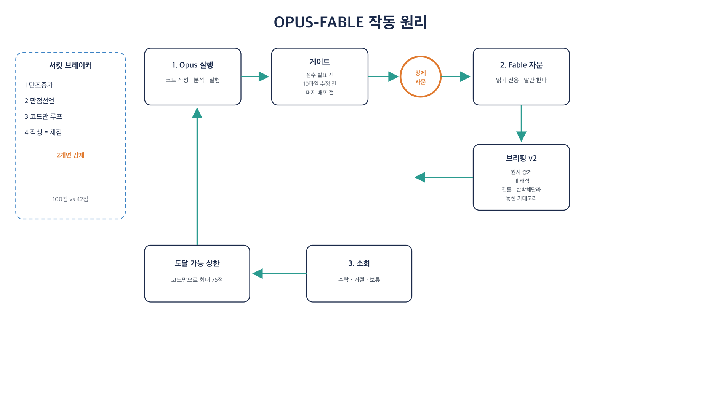

# opus-fable-orchestrator

Opus executes. Fable advises read-only at gates and on overconfidence signals.

## Skill editions

Each locale is a **git branch**. Install the branch you want.

| Edition | Branch | Install |
|---|---|---|
| English | [`main`](https://github.com/dalsoop/opus-fable-orchestrator/tree/main) | `npx skills add dalsoop/opus-fable-orchestrator -g -y` |
| Korean | [`ko`](https://github.com/dalsoop/opus-fable-orchestrator/tree/ko) | `npx skills add dalsoop/opus-fable-orchestrator@ko -g -y` |

You are on **English (`main`)**.

**Parent:** `/model` from `agent-model-registry get claude` (keep `[1m]` if the host uses it). Consult is not the parent. **Do not use Opus 5.0 as parent.**

```bash
npx skills add dalsoop/opus-fable-orchestrator -g -y
agent-model-registry get fable
python3 eval/run.py
```

Change the consult default: `agent-model-registry set fable <id>`. GUI: `agent-model-registry open`. Installed skills: `agent-skills open`.

<p align="center"><strong>English</strong></p>
<p align="center">
  
</p>

<p align="center"><strong>한국어</strong></p>
<p align="center">
  
</p>

[`SKILL.md`](SKILL.md) · [`templates/`](templates/) · [`eval/`](eval/) · MIT
