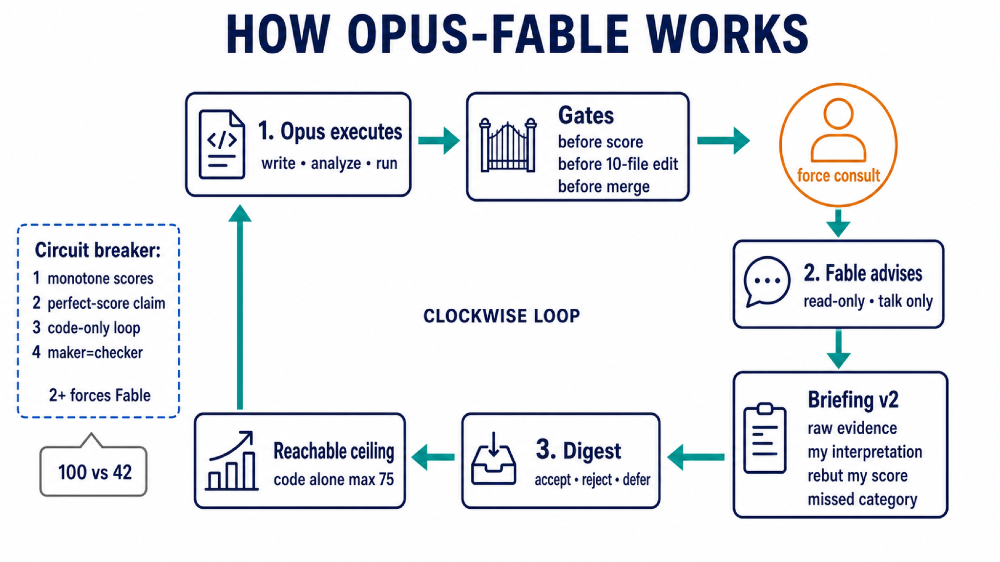

# opus-fable-orchestrator

Opus executes. Fable advises read-only at gates and on overconfidence signals.

## Skill editions

Each locale is a **git branch**. Install the branch you want.

| Edition | Branch | Install |
|---|---|---|
| English | [`main`](https://github.com/dalsoop/opus-fable-orchestrator/tree/main) | `npx skills add dalsoop/opus-fable-orchestrator -g -y` |
| Korean | [`ko`](https://github.com/dalsoop/opus-fable-orchestrator/tree/ko) | `npx skills add dalsoop/opus-fable-orchestrator@ko -g -y` |

You are on **English (`main`)**.

**Parent model:** `/model claude-opus-4-6[1m]` — Opus 4.6 1M is the executor. Fable is read-only. **Do not use Opus 5.0 as the parent — error rate is high.**

```bash
npx skills add dalsoop/opus-fable-orchestrator -g -y
python3 eval/run.py
```

<p align="center">
  
</p>

[`SKILL.md`](SKILL.md) · [`templates/`](templates/) · [`eval/`](eval/) · MIT
