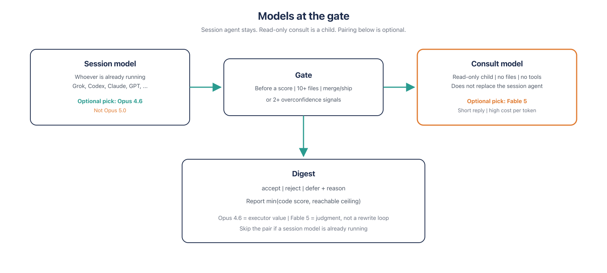

# orchestrator-consultant-gate

Before orchestration, critic the execution document (the plan and any child prompts) with read-only Fable. The session agent does not switch. The consult costs tokens and is not ground truth.

English (`main`). Korean: branch [`ko`](https://github.com/dalsoop/orchestrator-consultant-gate/tree/ko).

```bash
npx skills add dalsoop/orchestrator-consultant-gate -g -y
python3 scripts/resolve-consult.py --list --json
python3 scripts/resolve-consult.py --print-spawn
python3 scripts/resolve-consult.py --report --json
python3 scripts/resolve-consult.py --json
python3 eval/run.py
EVAL_LIVE=1 python3 eval/run.py   # Cursor/Claude spawn; Grok uses claude -p --max-turns 1. Cursor may skip on workspace trust.
```

`npx` copies **files**. A second opinion needs the **host** to spawn a child. That is not E2E from install.

Korean: `npx skills add dalsoop/orchestrator-consultant-gate@ko -g -y`

<p align="center">
  
</p>

One AI writes the **execution document** from the work order. **GATE** before orchestration and before audit-then-change. Fable **rebuts** it read-only: one more missed bottleneck, a hole in a child prompt, an omitted category. Notes go back. Same session. The payoff is **before dispatch**, in that document, not at merge. Claims are probabilistic. Digest them. Do not treat them as answers.

Pick the critic from `--list`. Default is Fable (`agent-model-registry get fable`). Spawn the `slug` from `--json`. If Fable is blocked, pick opus 4.6 from the list, not grok. `--report` is usage history, not critic quality. Grok: `--print-spawn` after `--list`; do not invent `claude -p`. Default eval is static; `EVAL_LIVE=1` only when asked. Hosts: Cursor, Claude Code, Codex, Grok TUI (`GROK_AGENT=1`). The session agent fills `templates/` at the gate.

[`SKILL.md`](SKILL.md) · [`templates/`](templates/) · [`scripts/`](scripts/) · [`eval/`](eval/) · MIT

[](https://skills.sh/dalsoop/orchestrator-consultant-gate)

Score a `SKILL.md`: `npx skills add dalsoop/skill-audit -g -y`

Vendored in host-skills-mono as `orchestrator-consultant-gate` (deploy: personal-mac). Public install is still `npx skills add`. Optional: `agent-model-registry set fable <id>`.
